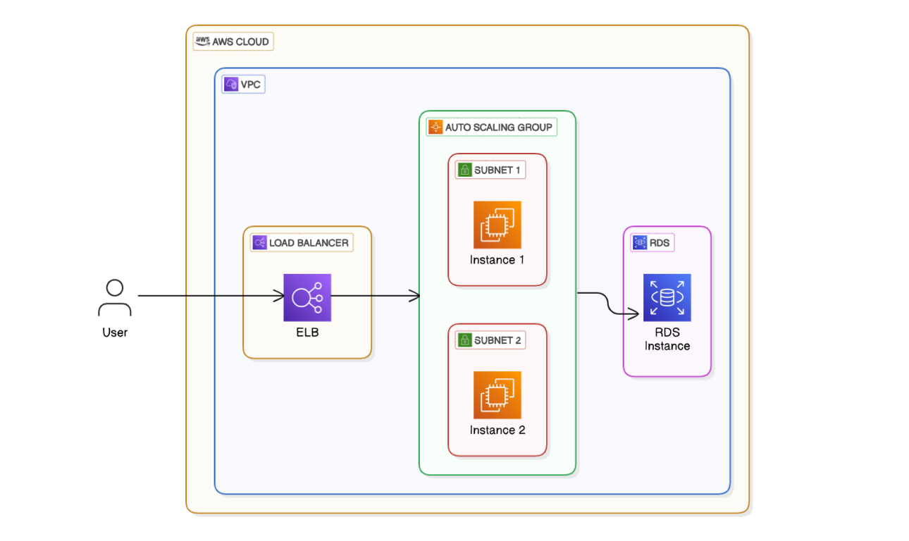

LAMP Stack AWS Deployment Template

This template provided a LAMP Stack (Linux, Apache, MySQL, PHP) setup on AWS for deploying a PHP-based website with high availability and scalability.
Architecture Overview
EC2 Instance (Ubuntu Linux): Hosts the PHP website with Apache web server.
MySQL (Amazon RDS): A managed relational database for storing application data.
Elastic Load Balancer (ELB): Distributes incoming traffic for high availability.

LAMP Stack AWS Architecture
This architectural diagram illustrates the LAMP Stack deployment on AWS with high availability using the following components:

✅ Elastic Load Balancer (ELB) – Distributes traffic across multiple EC2 instances.
✅ Auto Scaling Group (ASG) – Automatically scales instances across multiple subnets for fault tolerance.
✅ Amazon EC2 Instances (Ubuntu, Apache, PHP) – Hosts the PHP website.
✅ Amazon RDS (MySQL) – Manages the relational database securely.
✅ Subnets & VPC – Instances are placed in different subnets inside a VPC to ensure high availability.

💡 Security Measures:

ELB Security Group – Accepts incoming internet traffic.
EC2 Security Group – Accepts traffic only from ELB for security.
RDS Security Group – Accepts database connections only from EC2 instances.
📍 Usage:
Use this architecture as a reference for deploying a scalable and secure LAMP Stack on AWS.

